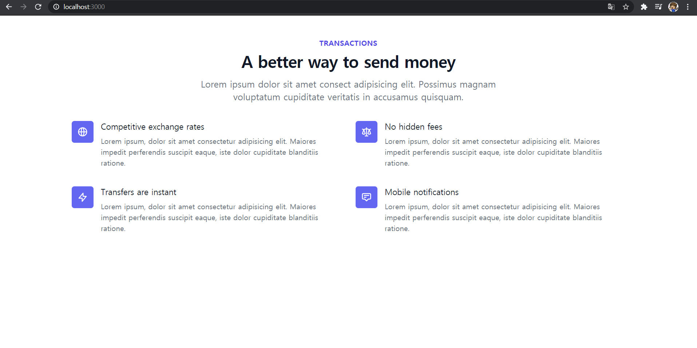

# tailwindcss with ReactJS

> [tailwindcss](https://tailwindcss.com/)는 html에 class를 이용해서 화면을 구성하는 방식의 css 라이브러리 입니다.
이 방식의 장점은 HTML만으로 직관적인 화면을 구성 할 수 있습니다.

ReactJS에서 tailwindcss를 사용하기 위해서는 몇가지 설정을 해야 합니다.

다음 설정을 따라 하면 tailwindcss를 사용할 수 있습니다. 

작업을 시작하기 전에 다음 사항을 유의하셔요.

- nodejs 12.13.x 이상 버젼만 가능합니다.

## 1. react 프로젝트 생성하기

```
npx create-react-app my-project
cd my-project
```

## 2. tailwind css 설정하기

```
npm install tailwindcss@npm:@tailwindcss/postcss7-compat @tailwindcss/postcss7-compat postcss@^7 autoprefixer@^9
```

> Create React App은 아직 postcss8을 지원하지 않습니다. 따라서 postcss7을 이용합니다.

## 3. CRACO 설치 & 설정

```
npm install @craco/craco
```

> Create React App에서 postcss 설정을 지원 하지 않습니다. tailwind 설정을 위해서 craco를 사용합니다.

```package.json```에서 ```start, build, test``` 명령어를 다음과 같이 설정을 변경 합니다.

```
{
    // ...
    "scripts": {
     "start": "craco start",
     "build": "craco build",
     "test": "craco test",
      "eject": "react-scripts eject"
    },
  }
```

그리고 ```craco.config.js``` 파일을 생성합니다.
해당 파일에서는 ```tailwindcss``` 와 ```autoprefixer``` plugin을 설정합니다.

```
// craco.config.js
module.exports = {
  style: {
    postcss: {
      plugins: [
        require('tailwindcss'),
        require('autoprefixer'),
      ],
    },
  },
}
```

## 4. tailwind 설정 파일 생성

```tailwind.config.js``` 파일을 생성합니다.

```
npx tailwindcss init
```

최상의 디렉토리에  최소 설정이된 ```tailwind.config.js``` 파일이 생성됩니다.

```
module.exports = {
  purge: [],
  darkMode: false, // or 'media' or 'class'
  theme: {
    extend: {},
  },
  variants: {
    extend: {},
  },
  plugins: [],
}
```

여기에 purge 설정을 추가 합니다.

```
 // tailwind.config.js
  module.exports = {
   purge: ['./src/**/*.{js,jsx,ts,tsx}', './public/index.html'],
    darkMode: false, // or 'media' or 'class'
    theme: {
      extend: {},
    },
    variants: {
      extend: {},
    },
    plugins: [],
  }
```

## 5. tailwind css 반영

```./src/index.css``` 에 다음을 추가 합니다.

```
/* ./src/index.css */
@tailwind base;
@tailwind components;
@tailwind utilities;
```

tailwind의 [base](https://tailwindcss.com/docs/adding-base-styles), [components](https://tailwindcss.com/docs/extracting-components), [utilities](https://tailwindcss.com/docs/adding-new-utilities)를 사용하도록 설정이 되었습니다.

## 6. tailwind css 예제 사용

```App.js``` 에 다음 코드를 추가 합니다.

```html
    <div class="py-12 bg-white">
      <div class="max-w-7xl mx-auto px-4 sm:px-6 lg:px-8">
        <div class="lg:text-center">
          <h2 class="text-base text-indigo-600 font-semibold tracking-wide uppercase">Transactions</h2>
          <p class="mt-2 text-3xl leading-8 font-extrabold tracking-tight text-gray-900 sm:text-4xl">
            A better way to send money
          </p>
          <p class="mt-4 max-w-2xl text-xl text-gray-500 lg:mx-auto">
            Lorem ipsum dolor sit amet consect adipisicing elit. Possimus magnam voluptatum cupiditate veritatis in accusamus quisquam.
          </p>
        </div>
    
        <div class="mt-10">
          <dl class="space-y-10 md:space-y-0 md:grid md:grid-cols-2 md:gap-x-8 md:gap-y-10">
            <div class="flex">
              <div class="flex-shrink-0">
                <div class="flex items-center justify-center h-12 w-12 rounded-md bg-indigo-500 text-white">
                  
                  <svg class="h-6 w-6" xmlns="http://www.w3.org/2000/svg" fill="none" viewBox="0 0 24 24" stroke="currentColor" aria-hidden="true">
                    <path stroke-linecap="round" stroke-linejoin="round" stroke-width="2" d="M21 12a9 9 0 01-9 9m9-9a9 9 0 00-9-9m9 9H3m9 9a9 9 0 01-9-9m9 9c1.657 0 3-4.03 3-9s-1.343-9-3-9m0 18c-1.657 0-3-4.03-3-9s1.343-9 3-9m-9 9a9 9 0 019-9" />
                  </svg>
                </div>
              </div>
              <div class="ml-4">
                <dt class="text-lg leading-6 font-medium text-gray-900">
                  Competitive exchange rates
                </dt>
                <dd class="mt-2 text-base text-gray-500">
                  Lorem ipsum, dolor sit amet consectetur adipisicing elit. Maiores impedit perferendis suscipit eaque, iste dolor cupiditate blanditiis ratione.
                </dd>
              </div>
            </div>
    
            <div class="flex">
              <div class="flex-shrink-0">
                <div class="flex items-center justify-center h-12 w-12 rounded-md bg-indigo-500 text-white">
                  
                  <svg class="h-6 w-6" xmlns="http://www.w3.org/2000/svg" fill="none" viewBox="0 0 24 24" stroke="currentColor" aria-hidden="true">
                    <path stroke-linecap="round" stroke-linejoin="round" stroke-width="2" d="M3 6l3 1m0 0l-3 9a5.002 5.002 0 006.001 0M6 7l3 9M6 7l6-2m6 2l3-1m-3 1l-3 9a5.002 5.002 0 006.001 0M18 7l3 9m-3-9l-6-2m0-2v2m0 16V5m0 16H9m3 0h3" />
                  </svg>
                </div>
              </div>
              <div class="ml-4">
                <dt class="text-lg leading-6 font-medium text-gray-900">
                  No hidden fees
                </dt>
                <dd class="mt-2 text-base text-gray-500">
                  Lorem ipsum, dolor sit amet consectetur adipisicing elit. Maiores impedit perferendis suscipit eaque, iste dolor cupiditate blanditiis ratione.
                </dd>
              </div>
            </div>
    
            <div class="flex">
              <div class="flex-shrink-0">
                <div class="flex items-center justify-center h-12 w-12 rounded-md bg-indigo-500 text-white">
                  
                  <svg class="h-6 w-6" xmlns="http://www.w3.org/2000/svg" fill="none" viewBox="0 0 24 24" stroke="currentColor" aria-hidden="true">
                    <path stroke-linecap="round" stroke-linejoin="round" stroke-width="2" d="M13 10V3L4 14h7v7l9-11h-7z" />
                  </svg>
                </div>
              </div>
              <div class="ml-4">
                <dt class="text-lg leading-6 font-medium text-gray-900">
                  Transfers are instant
                </dt>
                <dd class="mt-2 text-base text-gray-500">
                  Lorem ipsum, dolor sit amet consectetur adipisicing elit. Maiores impedit perferendis suscipit eaque, iste dolor cupiditate blanditiis ratione.
                </dd>
              </div>
            </div>
    
            <div class="flex">
              <div class="flex-shrink-0">
                <div class="flex items-center justify-center h-12 w-12 rounded-md bg-indigo-500 text-white">
                  
                  <svg class="h-6 w-6" xmlns="http://www.w3.org/2000/svg" fill="none" viewBox="0 0 24 24" stroke="currentColor" aria-hidden="true">
                    <path stroke-linecap="round" stroke-linejoin="round" stroke-width="2" d="M7 8h10M7 12h4m1 8l-4-4H5a2 2 0 01-2-2V6a2 2 0 012-2h14a2 2 0 012 2v8a2 2 0 01-2 2h-3l-4 4z" />
                  </svg>
                </div>
              </div>
              <div class="ml-4">
                <dt class="text-lg leading-6 font-medium text-gray-900">
                  Mobile notifications
                </dt>
                <dd class="mt-2 text-base text-gray-500">
                  Lorem ipsum, dolor sit amet consectetur adipisicing elit. Maiores impedit perferendis suscipit eaque, iste dolor cupiditate blanditiis ratione.
                </dd>
              </div>
            </div>
          </dl>
        </div>
      </div>
    </div>
```

## 7. 결과 확인

localhost 서버를 띄어서 확인해봅니다.

```
npm run start
```
http://localhost:3000 으로 접근 하면 다음과 같은 화면을 확인 할 수 있습니다.




## 마치며

위에 정리한 내용은 [Install Tailwind CSS with Create React App](https://tailwindcss.com/docs/guides/create-react-app)을 보고 따라 하였습니다.

코드를 보면서 직관적인 부분이 장점으로 다가오지만, html의 class가 너무 길어져서 불편하게 느껴지기도 했습니다.
또한, React에서는 class 를 className으로 Attribute를 변경해야 합니다.

많은 예제들이 나오고 있는 시점이라, 더욱 발전할 수 도 있겠다고 생각됩니다.

## 참고자료 
 - [Install Tailwind CSS with Create React App](https://tailwindcss.com/docs/guides/create-react-app)